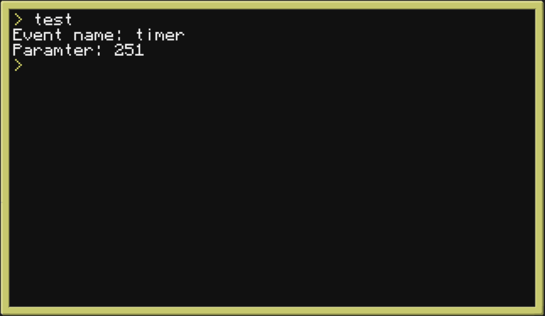

# stableEventHandler

#### A stable Eventhandler that allows you to add Callbacks to CC-Events

---

As long as this script is on the top level, there will not be any "Voided" Events which are usally removed while listening to a different, specific Event.

This is done by having 2 seperate coroutines, one which listens to events and one which executes the Callbacks. Therefore the listener gets **all** the Events and the Queue can implement things like `os.sleep(x)` without voiding other events for the listener while doing so.

---

## Example

```lua
-- Requirements
---@class stableEventHandler
local stableEventHandler = require("./stableEventHandler")


--checks if the triggert Event is the correct Event
local function checkFunction(event, parameters)
    return event[1] == "timer" and event[2] == parameters
end

--the function that should be run after the Event triggers
local function runAfterEvent(stableEvent, parameters)
    print('Event name: ' .. stableEvent.luaEvent[1])
    print('Paramter: ' .. parameters)
    stableEventHandler:removeCallback(stableEvent.eventID)
    stableEventHandler.listen = false
    os.queueEvent('Stop')
end

-- Example: Timer
local timer_id = os.startTimer(1)

-- Adding the Callback to the Event
local stableEvent = stableEventHandler:addCallback(
    checkFunction,
    runAfterEvent,
    nil,
    timer_id,
    true
)

stableEventHandler:start()
```


